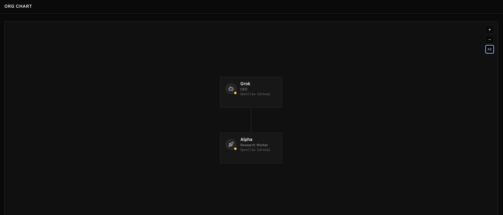
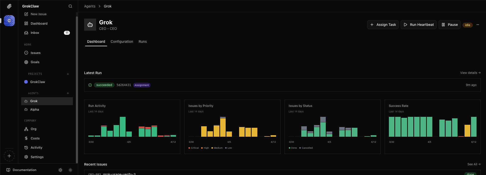

# GrokClaw

GrokClaw is an OpenClaw-powered multi-agent system with two active agents and two core workflows.

## Agents



| Agent | Model | Fallback | Role |
|-------|-------|----------|------|
| **Grok** | xAI Grok Fast | OpenRouter Nemotron 3 Super (free) | Coordinator, daily brief, PR review, Linear intake |
| **Alpha** | xAI Grok Fast | OpenRouter Nemotron 3 Super (free) | Hourly Polymarket research and trading |
| **Kimi** | — | — | Empty shell reserved for future assignment |

Every agent has a fallback chain so jobs never silently die when a provider hits rate limits.

## Core Workflows

### 1. Grok Daily System Brief

**Schedule:** 08:00 UTC daily

Produces one Telegram message covering the last 24 hours: what succeeded, what failed, what needs attention. Optionally posts one high-leverage improvement suggestion with an inline Approve button.

### 2. Alpha Polymarket Research and Paper Trading (Purely for fun)

**Schedule:** Hourly

Autonomous bonding-first trading loop: discovers near-resolution markets from known bonding wallets, evaluates edge, decides TRADE or HOLD, and posts a one-line summary to Telegram. No whale fallback — if no valid bonding setup exists, the run records HOLD.

## How It Works

```
Telegram ←→ OpenClaw Gateway ←→ Grok / Alpha agents
                  ↓
            Cron scheduler → cron-core-workflow-run.sh → agent turn
                  ↓
            Paperclip (per-run issue lifecycle)
            data/cron-runs/*.jsonl (execution history)
            data/audit-log/*.jsonl (Telegram audit trail)
            data/linear-creations/*.jsonl (Linear policy enforcement)
```

Every workflow run creates a Paperclip issue, writes a cron record, and posts to Telegram. If any of those are missing, the workflow health audit flags it.

## Integrations

| Integration | Purpose |
|-------------|---------|
| **Telegram** | Human operating surface — topic-based forum group |
| **Linear** | Engineering work tracking — only created after explicit approval |
| **GitHub** | Source control and PR review |
| **Paperclip** | Per-run operational dashboard |
| **OpenClaw** | Gateway, cron, and agent runtime |

### Telegram Topics

| Topic | Content |
|-------|---------|
| `suggestions` (2) | Daily brief, improvement proposals, approval outcomes |
| `polymarket` (3) | Alpha trading summaries |
| `health` (4) | Incidents, watchdog alerts, deploy results |
| `pr-reviews` (5) | Grok-reviewed PRs ready for merge |

## PaperClip — Operational Dashboard

[PaperClip](https://paperclip.dev) is the control plane for GrokClaw's agents. Every workflow run, every issue, and every cost event flows through it.



### How GrokClaw uses PaperClip

Every cron workflow run automatically creates a PaperClip issue, giving full traceability from trigger to completion. The dashboard surfaces what matters: which runs succeeded, which failed, and what needs attention — without digging through logs.

| Capability | How it's used |
|------------|---------------|
| **Run tracking** | Each agent run is recorded with status, run ID, and type — viewable in the Runs tab |
| **Issue lifecycle** | Workflow runs create issues; priorities (Critical → Low) and statuses (Done, Cancelled) track operational health |
| **Agent control** | Assign tasks, trigger heartbeats, and pause agents directly from the UI |
| **Cost visibility** | Per-agent and company-level cost tracking across all runs |
| **Activity feed** | Chronological log of everything that happened across the system |

### The org

PaperClip models GrokClaw as a company with an org chart. Grok is the CEO coordinating daily operations; Alpha reports in as a Research Worker running the Polymarket loop.

Both agents run through the OpenClaw Gateway — PaperClip sees the same execution layer that powers the cron scheduler and Telegram integration.

## Reliability Stack

| Layer | Tool | Schedule |
|-------|------|----------|
| Health probe | `tools/health-check.sh` | Every 2 min (system cron) |
| Gateway watchdog | `tools/gateway-watchdog.sh` | Every 5 min (launchd) |
| Workflow doctor | `tools/grokclaw-doctor.sh` | `:02, :17, :32, :47` (launchd) |
| Self-deploy | `tools/self-deploy.sh` | On merge |
| Cron validation | `tools/cron-jobs-tool.py` | On sync |

Health monitoring alerts Telegram once per failure with a one-tap rerun button. Workflow failures enter Linear only through an approval-gated draft — no automatic ticket creation.

## Knowledge Graph

GrokClaw uses [Graphify](https://github.com/BenSheridanEdwards/graphify) to maintain a navigable knowledge graph of the codebase.

- `graphify-out/wiki/index.md` — agent-crawlable wiki with community articles
- `graphify-out/graph.html` — interactive HTML visualization
- `graphify-out/graph.json` — GraphRAG-ready JSON
- `graphify-out/GRAPH_REPORT.md` — god nodes, communities, surprising connections

The daily brief prompt reads the wiki index to navigate the codebase efficiently instead of scanning raw files.

Rebuild after code changes: `./tools/graphify-rebuild.sh` (install [Graphify](https://github.com/BenSheridanEdwards/graphify) with `pip install -e /path/to/graphify`, or set `GRAPHIFY_SRC` to that repo root if the package is not already importable).

## Polymarket Strategy

Alpha runs a bonding-copy strategy (Dexter-style):

- Near-resolution evaluation window: 95c–100c, up to ~36h to resolution
- Copy-trader positions from known bonding wallets with consensus alignment
- Deterministic bonding gates — no whale fallback path
- Paper trading with memory-backed self-improvement (MemPalace)

Decision tools: `polymarket-trade.sh` → `polymarket-decide.sh` → `polymarket-resolve-turn.sh`

## Linear Policy

Linear issues are only created in two flows:

1. Ben approves a daily suggestion (two-step: approve suggestion → approve drafted ticket)
2. Ben explicitly requests a bug fix or feature in Telegram

All creations are logged to `data/linear-creations/*.jsonl`. The daily brief flags any violations.

## Key Docs

| Doc | Purpose |
|-----|---------|
| `NorthStar.md` | Source of truth for the operating model |
| `AGENTS.md` | Agent operating instructions and multi-agent layout |
| `CURSOR.md` | Cursor implementation contract |
| `docs/multi-agent-setup.md` | Multi-agent technical setup |
| `docs/system-architecture.md` | Architecture overview |
