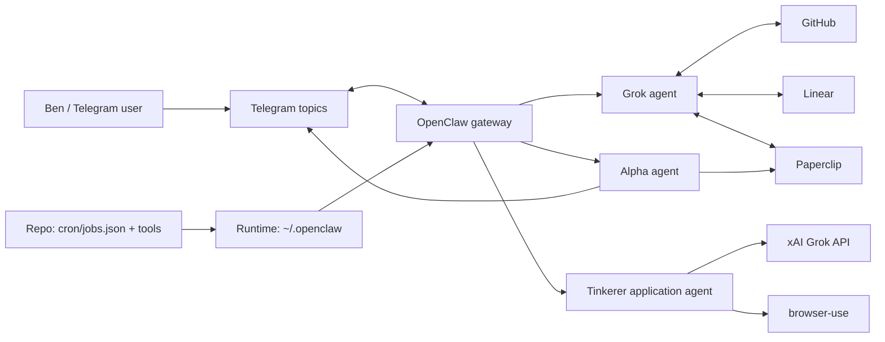
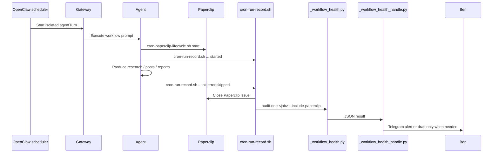
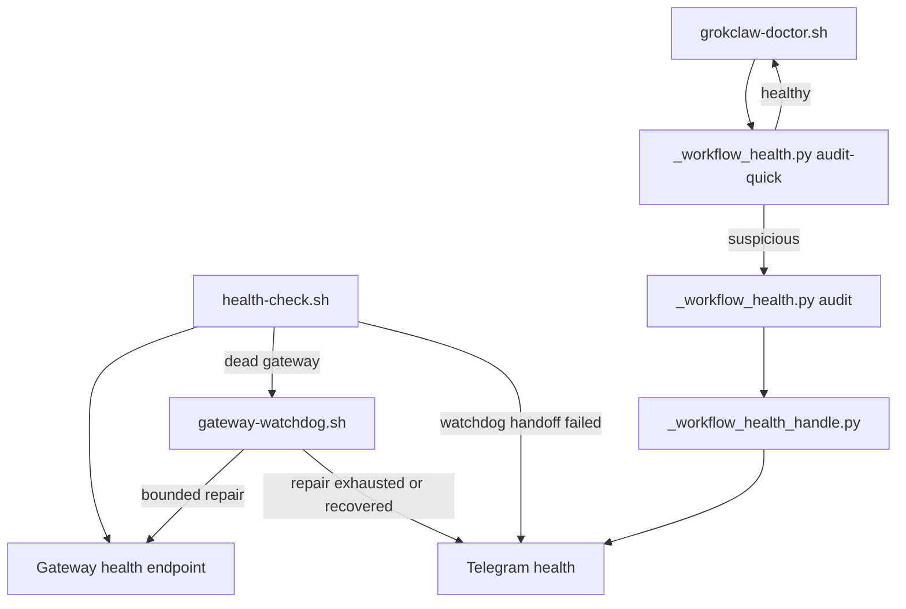

# System Architecture

This document captures the current GrokClaw runtime topology and the main evidence paths that keep the system inspectable.

`NorthStar.md` remains the policy document. This file is the operational map.

## Runtime snapshot

As of 2026-04-05, the live OpenClaw runtime is centered on one local gateway plus supporting local services:

- OpenClaw gateway on `127.0.0.1:18800`
- Paperclip on `127.0.0.1:3100`
- Repo workspace at `/Users/jarvis/Engineering/Projects/GrokClaw`
- Runtime config at `~/.openclaw/openclaw.json`
- Runtime cron at `~/.openclaw/cron/jobs.json`

Active agent roles in the live runtime:

- `grok` is the coordinator, reviewer, and operator
- `alpha` runs the hourly Polymarket workflow
- `tinkerer` is the application agent for the Stationed AI Tinkerer role (manual invoke, not cron-scheduled)

Active scheduled OpenClaw workflows in the live runtime:

- `grok-daily-brief`
- `alpha-polymarket`

Supporting schedulers outside OpenClaw cron:

- `tools/health-check.sh` via system crontab every 2 minutes
- `tools/gateway-watchdog.sh` via launchd every 5 minutes on explicit offsets
- `tools/grokclaw-doctor.sh --check --quiet` via launchd at `02,17,32,47`
- `tools/pr-review-watch.sh` via launchd for GitHub PR queue wakeups

## System context

## Core workflow execution

Each core workflow follows the same evidence-first path: create a Paperclip run issue, write early run evidence, do the work, then write final evidence and audit the result.

## Reliability layers

The reliability design is intentionally split so gateway liveness, automatic repair, and workflow contract validation do not collapse into one script.

## Evidence model

The system is only operationally complete when a run can be seen in the right evidence surfaces:

- `data/cron-runs/*.jsonl` for structured run history
- Paperclip issue lifecycle for per-run state and summaries
- `data/audit-log/*.jsonl` for Telegram output and action evidence
- `data/research/...` for workflow artifacts
- `data/agent-reports/...` where cross-agent reporting is expected
- `data/linear-creations/*.jsonl` for approval-gated engineering work

## Configuration surfaces

There are two separate configuration layers:

1. Repo source of truth: `cron/jobs.json`, docs, scripts, and tests
2. Live runtime state: `~/.openclaw/openclaw.json`, `~/.openclaw/cron/jobs.json`, launchd jobs, and state files under `~/.openclaw/state`

When behavior looks wrong, check both layers before concluding the system is broken:

- repo drift can mislead operators
- runtime drift can leave deployed behavior different from checked-in docs
- state files can keep reminders or dedupe behavior open after an incident

## Current runtime drift

The 2026-04-05 runtime audit found a few important differences between the repo docs and the live runtime:

- live runtime currently has 2 active OpenClaw cron workflows
- live runtime routes `alpha` to `openrouter/nvidia/nemotron-3-super-120b-a12b:free` (no fallback)
- `tinkerer` is the application agent for the Stationed AI Tinkerer role, manually invoked via `./tools/run-tinkerer-apply.sh`; uses `xai/grok-4-1-fast-non-reasoning` for answer generation and `grok-3-fast` for browser automation
- `~/.openclaw/openclaw.json` still reports stale `meta.lastTouchedVersion` even though the installed CLI is newer

Treat this section as an operator warning: when in doubt, verify with `openclaw --version`, `openclaw agents list`, and `openclaw cron list`.
